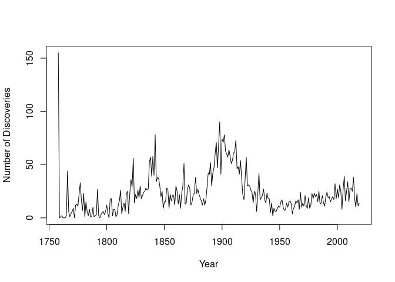
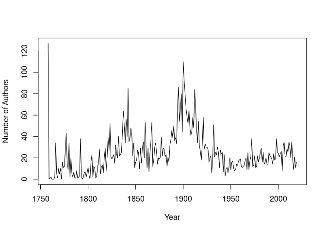
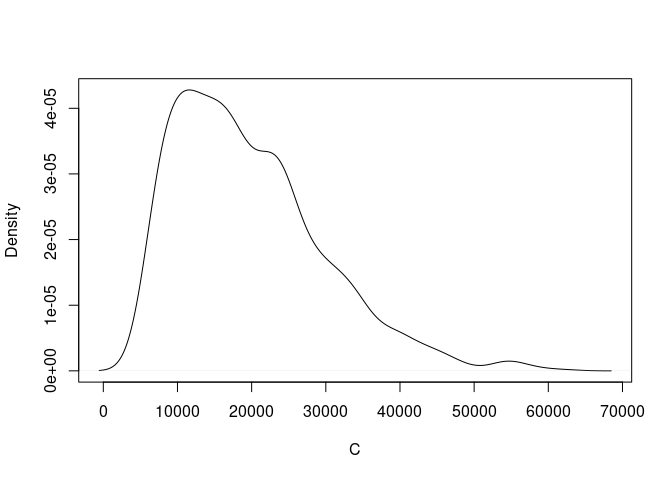
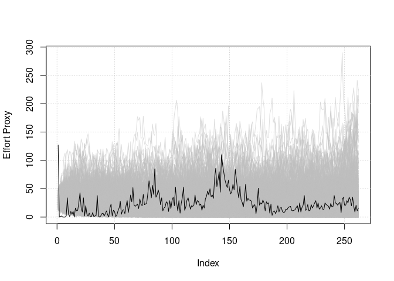
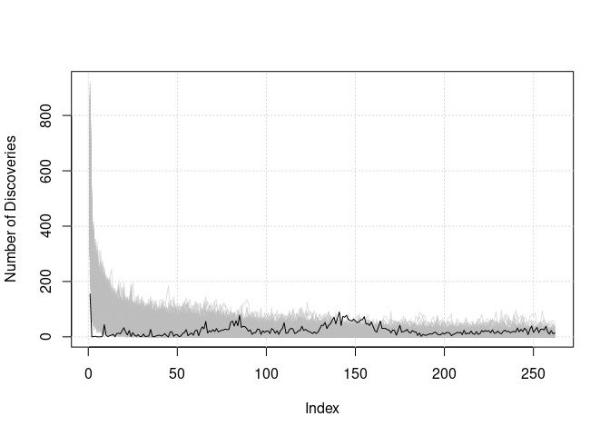

<!-- README.md is generated from README.Rmd. Please edit that file -->

# NoC

<!-- badges: start -->
<!-- badges: end -->

The **N**umber **o**f **C**lasses package contains a function that
estimates the total number of classes of a kind, given the discovery
rate of known classes and a numerical proxy of effort.

## Installation

The `NoC` package can be downloaded and installed from Github like so
using the `devtools` package:

``` r
# devtools::install_github("DanDempsey/NoC")
```

or like so using the `remotes` package:

``` r
# remotes::install_github("DanDempsey/NoC")
```

## Brief Explanation and Example

Example datasets are provided in the package, each corresponding to a
class of animals: `Aves`, `Isopoda`, `Mammalia`, and `Nematoda`. These
are dataframes with two columns: one giving the number of new species
discovery within the respective class per year, and the number of unique
authors of published taxonomy listings per year (this includes authors
of listings for species that were not unique) between 1758 and 2019.
Note that the counting of author numbers are not perfect as we cannot
distinguish multiple authors with the same name or multiple names for
the same author, and so on. The data were derived from Catalogue of Life
data.

The package could be used here to estimate the total number of species
within these animal classes, given the number that have already been
discovered and some proxy for the amount of effort exerted to make those
discoveries; for the species data, the number of authors represent our
proxy data. Let us focus on Mammalia for this example.

``` r
library( NoC )
data( Mammalia )

plot( rownames(Mammalia), Mammalia$Discovery_Numbers, type = 'l', xlab = 'Year', ylab = 'Number of Discoveries' )
```



``` r
plot( rownames(Mammalia), Mammalia$Author_Numbers, type = 'l', xlab = 'Year', ylab = 'Number of Authors' )
```



To estimate the total number of species, denoted as `C` in the code, we
use the `CD_ABC` function. This constructs an approximate posterior
distribution for `C` via Approximate Bayesian Computation (ABC). It
works by fitting a generative model of species estimation (a discovery
curve) based on the known effort proxy and discovery times. Our model
won’t be discussed here, but suffice to say it is a Bayesian model and
thus requires the tuning of prior probabilities to fit.

There are a number of inputs for `CD_ABC`, and 6 of these **must** be
supplied by the user for the function to work. They are `iters` (the
number of ABC iterations), `x` (the effort proxy), `t` (the discovery
times) and three vectors that correspond to prior parameters, `theta_N`,
`theta_l`, and `theta_x`. `theta_N` is a vector of two components,
corresponding to the mean and standard deviation of the species
abundance on the log scale. `theta_l` is also a vector of length two,
characterising a latent effort process, which is modelled as an
intrinsic Gaussian Markov random process (IGMRF). The first component of
`theta_l` is the starting value of the latent effort process, and the
second is the standard error of the IGMRF. Finally, `theta_x` is a
scalar that represents the difference in mean between the observed
effort proxy and the latent effort process, which we assume here to
roughly correspond to the number of unique discoveries per author.

Although the above are the only parameters the user must supply, it is
important to consider at least a few other of the optional parameters.
Foremost perhaps is the `m` parameter; this controls the upper limit of
the total number of species. To be more precise, we assume that the
total number of species cannot exceed the the number of discoveries thus
far multiplied by `m`. By default we assume `m = 10` but this is not
necessarily a reasonable assumption in practice.

Another important parameter is `epsilon`. Every iteration, the ABC
algorithm simulates effort proxy and discovery rate data based on
proposed values of `C`, and measures their distance from the observed
data. The iteration (and thus value of `C`) is accepted if it falls
within an accepted threshold, given from the user by `epsilon`. If
`epsilon` is set to a negative number (as it is by default) then it is
set to infinity and thus every iteration is accepted. A rudimentary
approach to setting `epsilon` is to run a pilot study and then setting a
threshold based on its results.

The following is an example of a pilot study of the Mammalia data:

``` r
pilot_run <- CD_ABC( 1e3, x = Mammalia$Author_Numbers, t = Mammalia$Discovery_Numbers,
                     theta_N = c(log(1e9), 1.1), theta_x = log(1),
                     theta_l = c(log(30), 0.15), m = 20 )
```

The output of this function is a list with four elements: one is the
accepted values of `C` from the approximate posterior, another is the
value of the distance metrics. The remaining two are the simulated
values of the effort proxy and discovery times. For the actual run, we
set the threshold as the 10th percentile of the distances of the pilot
study.

``` r
thresh <- quantile( pilot_run$distance, 0.1 )
actual_run <- CD_ABC( 1e4, x = Mammalia$Author_Numbers, t = Mammalia$Discovery_Numbers,
                      theta_N = c(log(1e9), 1.1), theta_x = log(1),
                      theta_l = c(log(30), 0.15), m = 20, epsilon = thresh )
```

Note that for illustration purposes we are only running 10,000
iterations. In practice you would likely need more for reasonable
exploration of the approximate posterior.

Suggested output for `C` is a kernel density plot:

``` r
plot( density(actual_run$C), type = 'l', main = '', xlab = 'C' )
```



Once this is done, it is important to check that the ABC simulated data
fits the observed data well. If not, you may need to tweak the values of
`theta_N`, `theta_l` and `theta_x` accordingly. The following code
produces a useful plot for diagnostics:

``` r
library( scales )

xhat <- actual_run$x_hat
x <- Mammalia$Author_Numbers
plot( x, type = 'n', ylim = range(rbind(x, xhat)), ylab = 'Effort Proxy', 
      xlab = 'Index' )
grid()
for ( i in 1:nrow(xhat) ) {
  lines( xhat[i, ], col = alpha('grey', 0.5) )
}
lines( x )
```



``` r
  
that <- actual_run$t_hat
t <- Mammalia$Discovery_Numbers
plot( t, type = 'n', ylim = range(rbind(t, that)), ylab = 'Number of Discoveries', 
      xlab = 'Index' )
grid()
for ( i in 1:nrow(that) ) {
  lines( that[i, ], col = alpha('grey', 0.5) )
}
lines( t )
```



## Acknowledgments

This package includes portions of code derived from the R source code.
The original code is the work of the R Core Team and contributors to the
R Project. Adaptations were made in accordance with the GPL-3 license.
