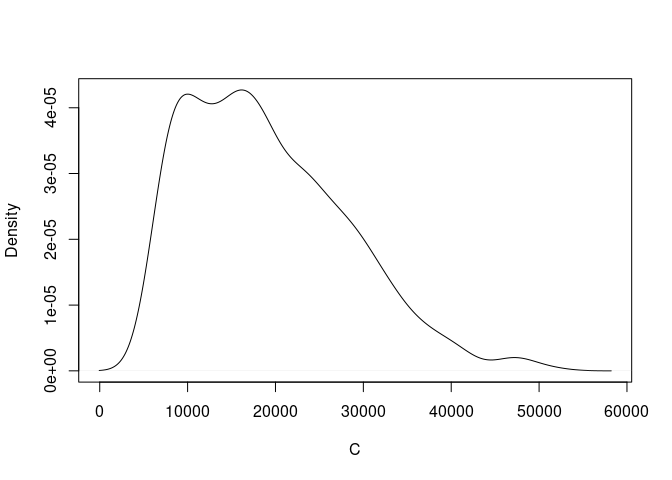
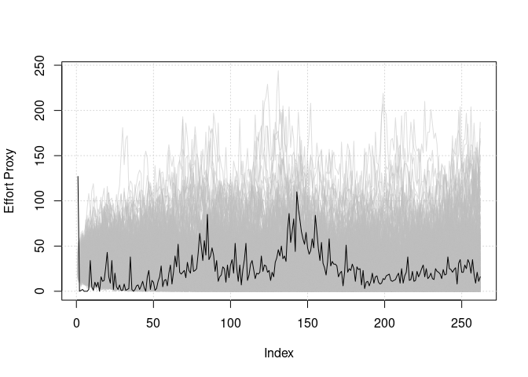

<!-- README.md is generated from README.Rmd. Please edit that file -->

# NoC

<!-- badges: start -->
<!-- badges: end -->

The **N**umber **o**f **C**lasses package contains a function that
estimates the total number of classes of a kind, given the discovery
rate of known classes and a numerical proxy of the effort exerted during
the discovery process.

## Installation

The `NoC` package can be downloaded and installed from Github like so
using the `devtools` package:

``` r
# devtools::install_github("DanDempsey/NoC")
```

or like so using the `remotes` package:

``` r
# remotes::install_github("DanDempsey/NoC")
```

## Brief Explanation and Example

Example datasets are provided in the package, each corresponding to a
class of animals: `Aves`, `Isopoda`, `Mammalia`, and `Nematoda`, all
derived from the [Catalogue of Life](https://www.catalogueoflife.org/).
These are dataframes with two columns: one giving the number of new
species discovered per year, and the number of unique authors of
published taxonomy listings per year (this includes authors of listings
for species that were not unique) between 1758 and 2019. Note that there
are difficulties with counting the authors; for example multiple authors
may have the same name, or single authors may go by different names, and
so on. Thus the reported number of authors per year in these datasets
should be considered an imperfect approximation.

Let us focus on the `Mammalia` data. Let’s say we want to approximate
the total number of mammals that may exist given how many we’ve
discovered thus far, perhaps to answer larger questions around
biodiversity and extinction risk. Ideally our approximation method
should incorporate some proxy measurement of effort; in this case, we
use the number of distinct authors per year.

``` r
library( NoC )
data( Mammalia )

plot( rownames(Mammalia), Mammalia$Discovery_Numbers, type = 'l', xlab = 'Year', ylab = 'Number of Discoveries' )
```


``` r
plot( rownames(Mammalia), Mammalia$Author_Numbers, type = 'l', xlab = 'Year', ylab = 'Number of Authors' )
```


To estimate the total number of mammal species, which we will henceforth
denote as `C`, we use the `CD_ABC` function. This constructs an
approximate posterior distribution for `C` via Approximate Bayesian
Computation (ABC). The model we fit is explained in (SPECIES ESTIMATION
PAPER); we strongly recommend those interested in using this package to
read that paper, especially sections 2 and 3, as we will not be
discussing the model here, and some understanding of the model will be
required to understand the input parameters of `CD_ABC`.

Of all the input parameters for `CD_ABC`, 6 of these **must** be
supplied by the user for the function to work. They are `iters` (the
number of ABC iterations), `x` (the effort proxy), `t` (the discovery
times) and three vectors that correspond to prior parameters, `theta_N`,
`theta_l`, and `theta_x`. `theta_N` is a vector of length two,
corresponding to the mean and standard deviation of the species
abundance on the log scale. `theta_l` is also a vector of length two,
encoding the settings of an Intrinsic Gaussian Markov Random Field
(IGMRF), which represents a **latent** effort process. The first
component of `theta_l` is the starting value of the latent effort
process, and the second is the standard deviation. Finally, `theta_x` is
a scalar that represents the difference in mean between the observed
effort proxy and the latent effort process; for our example, we assume
this corresponds to the number of unique discoveries per author per
year.

Although the above are the only parameters the user must supply, it is
important to consider at least a few other of the optional parameters.
Foremost perhaps is the `m` parameter, which controls the upper limit of
the total number of species; to be more precise, we assume that the
total number of species cannot exceed the number of discoveries thus far
multiplied by `m`. By default we assume `m = 10` but this is not
necessarily a reasonable assumption in practice.

Another important parameter is `epsilon`, which is the acceptance rate
of the ABC algorithm. If `epsilon` is set to a negative number (as it is
by default) then infinity is the threshold and thus every iteration is
accepted. A rudimentary approach to setting `epsilon` is to run a pilot
study and then setting a threshold based on its results.

The following is an example of a pilot study of the `Mammalia` data:

``` r
pilot_run <- CD_ABC( 1e3, x = Mammalia$Author_Numbers, t = Mammalia$Discovery_Numbers,
                     theta_N = c(log(1e9), 1.1), theta_x = log(1),
                     theta_l = c(log(30), 0.15), m = 20 )
```

The output of this function is a list with four elements: one is the
accepted values of `C` from the approximate posterior, another is the
value of the distance metrics used to evaluate the ABC simulated
processes. The remaining two are the simulated values of the effort
proxy and discovery times, generated as part of the ABC’s process. For
the actual run, we can set the threshold as some percentile of the
observed distance metrics from the pilot study. Here, we take the 10th
percentile:

``` r
thresh <- quantile( pilot_run$distance, 0.1 )
actual_run <- CD_ABC( 1e4, x = Mammalia$Author_Numbers, t = Mammalia$Discovery_Numbers,
                      theta_N = c(log(1e9), 1.1), theta_x = log(1),
                      theta_l = c(log(30), 0.15), m = 20, epsilon = thresh )
```

Note that for illustration purposes we are only running 10,000
iterations. In practice you would likely need more for a thorough
exploration of the approximate posterior.

Once it has finished running, we canuse a density plot to visualise our
result:

``` r
plot( density(actual_run$C), type = 'l', main = '', xlab = 'C' )
```



It is also important to check that the ABC simulated data fits the
observed data well. If not, you may need to tweak the values of
`theta_N`, `theta_l` and/or `theta_x` accordingly. The following code
produces a useful plot for diagnostics:

``` r
library( scales )

xhat <- actual_run$x_hat
x <- Mammalia$Author_Numbers
plot( x, type = 'n', ylim = range(rbind(x, xhat)), ylab = 'Effort Proxy', 
      xlab = 'Index' )
grid()
for ( i in 1:nrow(xhat) ) {
  lines( xhat[i, ], col = alpha('grey', 0.5) )
}
lines( x )
```



``` r
  
that <- actual_run$t_hat
t <- Mammalia$Discovery_Numbers
plot( t, type = 'n', ylim = range(rbind(t, that)), ylab = 'Number of Discoveries', 
      xlab = 'Index' )
grid()
for ( i in 1:nrow(that) ) {
  lines( that[i, ], col = alpha('grey', 0.5) )
}
lines( t )
```


## Acknowledgments

This package includes portions of code derived from the R source code.
The original code is the work of the R Core Team and contributors to the
R Project. Adaptations were made in accordance with the GPL-3 license.
